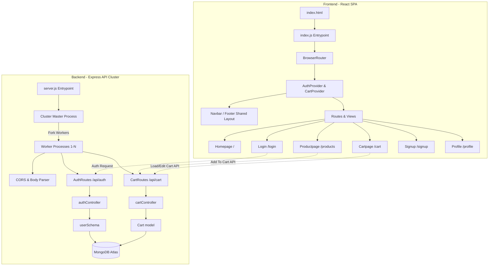

# Zonda — Full-Stack E-Commerce Application

Zonda is a modern, high-performance, full-stack e-commerce web application featuring a decoupled client-server architecture:
*   **Frontend**: A responsive Single Page Application (SPA) built using **React**, styled with **Bootstrap 5.3** and custom CSS variables for premium themes and micro-animations. Routing is handled via **React Router DOM**.
*   **Backend**: A high-availability API built with **Node.js** and **Express**, utilizing **Node Clustering** for multi-core load balancing, managing data persistence in **MongoDB Atlas** via **Mongoose**, and handling authentication using JWTs.

---

## 🏗️ System Architecture & Design



---

## 📁 Directory Structure

The project separates the full-stack codebase into `frontend` and `backend` workspaces:

```text
zonda/
├── backend/
│   ├── config/
│   │   ├── db.js              # Database connection & seed synchronization
│   │   └── seedProducts.js    # Default seed product registry data
│   ├── controller/
│   │   ├── authController.js  # Registration, login & profile API actions
│   │   └── cartController.js  # Add, get, update, remove, and clear cart actions
│   ├── middleware/
│   │   └── authMiddleware.js  # JWT validation & user attachment middleware
│   ├── model/
│   │   ├── Cart.js            # User shopping cart Mongoose schema
│   │   ├── Product.js         # Product Mongoose schema
│   │   └── userSchema.js      # User registration & hashed password Mongoose schema
│   ├── routes/
│   │   ├── authRoutes.js      # Auth API mappings (/signup, /login, /me, /become-seller)
│   │   ├── cartRoutes.js      # Cart API mappings (/add, /update, /remove/:id)
│   │   └── productRoutes.js   # Product API mappings
│   ├── .env                   # Server environment variables (DB URI, JWT secret)
│   ├── server.js              # Express app config & master clustering entry point
│   └── package.json           # Node scripts and dependencies
│
└── frontend/
    ├── public/
    │   ├── media/             # Image resources & product assets
    │   └── index.html         # Main HTML markup
    ├── src/
    │   ├── context/
    │   │   ├── AuthContext.js # Auth global provider (tokens, login, logout states)
    │   │   └── CartContext.js # Cart global provider (cart items, counts, sync logic)
    │   ├── landingpage/
    │   │   ├── about/
    │   │   │   ├── Aboutpage.js   # About page (company story and values)
    │   │   │   └── Team.js        # Team showcase component
    │   │   ├── deal/
    │   │   │   ├── Branddeal.js   # Brand partnership spotlight cards
    │   │   │   └── Dealpage.js    # Flash deals with active countdown timer
    │   │   ├── home/
    │   │   │   ├── Brand.js       # Partner brand spotlights
    │   │   │   ├── Feature.js     # Featured products catalog
    │   │   │   ├── Hero.js        # Interactive hero carousel
    │   │   │   ├── Homepage.js    # Landing page aggregator
    │   │   │   └── Suggest.js     # "Recommended For You" carousel/cards
    │   │   ├── product/
    │   │   │   ├── BrandStore.js  # Dedicated official brand stores
    │   │   │   ├── ProductDetails.js # Dynamic product details page with specs
    │   │   │   └── Productpage.js # Full catalog with filtering & search
    │   │   ├── seller/
    │   │   │   ├── Sellerpage.js  # Seller dashboard for publishing/editing listings
    │   │   │   ├── Sellerdetails.js
    │   │   │   └── Product.js
    │   │   ├── singup/
    │   │   │   ├── Cartpage.js    # Cart dashboard, totals, and checkout flow
    │   │   │   ├── Login.js       # User login screen with eye toggle
    │   │   │   ├── Profilepage.js # User profile dashboard
    │   │   │   └── Singup.js      # Registration page with eye toggles
    │   │   ├── support/
    │   │   │   └── Supportpage.js # Support forms and FAQs
    │   │   ├── Footer.js          # Premium website footer
    │   │   └── Navbar.js          # Sticky blur-backdrop header & dynamic badge
    │   ├── index.css              # Typography, themes and global CSS variables
    │   └── index.js               # React SPA router bootstrap & provider wrapper
    └── package.json           # Frontend scripts and dependencies
```

---

## ✨ Features Spotlight

### 1. Auto-Sliding Banner Hero (`Hero.js`)
* **Responsive Multi-Item View**: Displays 3 banner images at a time on desktop, 2 on tablets, and wraps to 1 banner on mobile screens.
* **Uniform Layout Aspect Ratios**: All banners share the exact same height and width, and use `object-fit: cover` to avoid image squishing.
* **Smart Navigation**: Includes custom-styled next/prev arrow buttons and responsive pill-shaped indicators.
* **Auto-Play**: Automatically cycles through images every 5 seconds.

### 2. Spotlight Brands Grid (`Brand.js` & `BrandStore.js`)
* **Spotlight Grids**: Interactive rectangular brand cards with subtle border outlines and soft shadows.
* **Official Brand Stores**: Supports navigation to dedicated pages (`/brand/:brandName`) showcasing filtered products and customized themes.
* **Rich Card Content**: Displays brand details, custom gradient backgrounds, and selling tags.

### 3. Dynamic Product Catalog (`Productpage.js` & `ProductDetails.js`)
* **10-Category Filter Bar**: Filters products in real-time (Smartphones, Laptops, Audio, Smartwatches, TVs, Gaming, Home Appliances, Cameras, Accessories, Monitors, plus an "All Products" option).
* **Advanced Visual Effects**: Card hover lifts alongside image-zoom transitions.
* **Dynamic Product Details**: Product-specific pages (`/products/:id`) featuring rating breakdowns, active specs lists, stock alerts, a quantity selector, and related product recommendations.

### 4. Interactive Seller Dashboard (`Sellerpage.js`)
* **Onboarding Flow**: Allows standard customers to upgrade their profile to a seller profile with a single click.
* **Inventory Control Center**: Allows sellers to publish new products (with titles, category selections, pricing, descriptions, stock inventory count, and image URLs or Base64 file uploads) and edit or delete their existing listings in real-time.

### 5. Shopping Cart & Flash Deals (`Cartpage.js` & `Dealpage.js`)
* **Global Context Management**: Syncs addition, updates, removals, and checkout simulation with MongoDB.
* **Real-time Countdown**: `Dealpage.js` simulates active lightning deals with hours/minutes/seconds countdown hooks.

---

## 🛠️ Technology Stack & Refactoring

### Language Migration
The frontend client codebase was recently migrated from TypeScript to **Standard JavaScript (ES6 / React JSX)**.
- All types, interface definitions (`Product`, `User`, `CartItem` in `types.ts`), React generic states, parameter assertions, and TSX files have been cleaned up and replaced with modular, lightweight JS/JSX structures.
- Removed TypeScript compile dependencies (`typescript`, `@types/react`, `@types/react-dom`, `@types/node`) and cleared the `tsconfig.json` configuration file to streamline the webpack compilation step.

### Clustering & Seeding Synchronization (Backend)
- Spawns concurrent worker processes using the Node `cluster` module matching the machine's CPU core capacity to optimize performance.
- Implements concurrent seeding race-condition safety inside `backend/config/db.js`. If multiple workers attempt to seed products simultaneously on startup, duplicate key errors (`E11000`) are caught gracefully, preventing workers from crashing and ensuring seamless initialization.

---

## 📡 API Endpoints Spec

### Auth API (`/api/auth`)
* `POST /signup` - Registers a new user, hashes password, saves to DB, and returns a JWT token.
* `POST /login` - Matches credentials and returns a JWT token.
* `GET /me` - Returns logged-in user profile parameters (requires authentication).
* `PUT /become-seller` - Upgrades logged-in user profile to a seller profile (requires authentication).

### Cart API (`/api/cart`)
* `GET /` - Fetches authenticated user's cart (creates one if none exists).
* `POST /add` - Appends item or increments quantity if item already exists.
* `PATCH /update` - Modifies quantity values.
* `DELETE /remove/:productId` - Removes product.
* `DELETE /clear` - Empties the cart array (checkout simulation).

### Products API (`/api/products`)
* `GET /` - Retrieves all products.
* `GET /:id` - Retrieves a specific product by ID.
* `GET /seller/me` - Retrieves products published by the logged-in seller.
* `POST /` - Publishes a new product listing (requires seller privileges).
* `PUT /:id` - Updates a product listing (requires seller privileges).
* `DELETE /:id` - Deletes a product listing (requires seller privileges).

---

## 🚀 Getting Started

### Prerequisites
* **Node.js** (v18+ recommended)
* **npm** (v9+ recommended)
* **MongoDB Atlas** account (or local MongoDB database instance)

---

### Setup Instructions

#### 1. Setup the Backend Server
1. Navigate to the `backend` directory:
   ```bash
   cd backend
   ```
2. Install the server dependencies:
   ```bash
   npm install
   ```
3. Create a `.env` file in the root of the `/backend` folder and define your database credentials:
   ```env
   PORT=5000
   MONGO_URI=your_mongodb_atlas_connection_string
   JWT_SECRET=your_jwt_secret_key
   ```
4. Start the backend dev server:
   ```bash
   npm start
   ```
   *(Runs on http://localhost:5000)*

---

#### 2. Setup the Frontend Client
1. Open a new terminal window and navigate to the `frontend` directory:
   ```bash
   cd frontend
   ```
2. Install the client dependencies:
   ```bash
   npm install
   ```
3. Start the React development server:
   ```bash
   npm start
   ```
   *(Launches the app on http://localhost:3000)*
