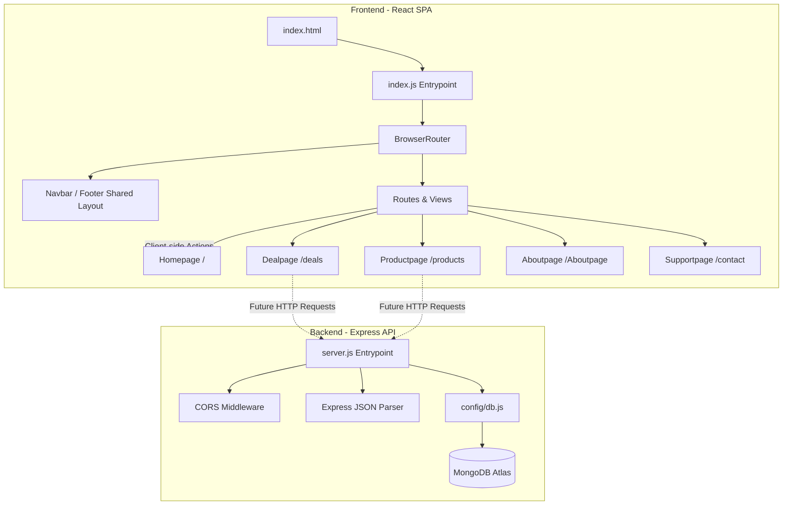

# Zonda Core Architecture & System Design Report

This document details the core architecture, component hierarchy, frontend routing and logic, and backend configurations of the **Zonda** e-commerce application. 

---

## 1. System Architecture & Data Flow

Zonda is structured as a decoupled client-server application consisting of a React Single Page Application (SPA) on the frontend and an Express REST API backend on Node.js.

Zonda is built as a full-stack web application with a decoupled client-server architecture:
*   **Frontend**: Built with **React 19** and **React Router DOM 7**, styled with **Bootstrap 5.3** and custom CSS variables for premium themes and micro-animations. It acts as a Single Page Application (SPA).
*   **Backend**: Built with **Node.js** and **Express 5**, managing configurations, environment variables, and connections to **MongoDB Atlas** database via **Mongoose**.



---

## 2. Directory Structure

The project has a monorepo-style structure separating `frontend` and `backend` codebases:

```text
zonda/
├── backend/
│   ├── config/
│   │   └── db.js              # Database connection configuration
│   ├── node_modules/          # Backend dependencies
│   ├── .env                   # Environment variables (local keys)
│   ├── package.json           # Node configuration & dependencies
│   └── server.js              # Express app entry point
└── frontend/
    ├── public/
    │   ├── media/             # Image resources & product assets
    │   └── index.html         # Main HTML markup
    ├── src/
    │   ├── context/
    │   │   ├── AuthContext.js # Auth global provider (tokens, login, logout states)
    │   │   └── CartContext.js # Cart global provider (cart items, counts, sync logic)
    │   ├── landingpage/
    │   │   ├── about/
    │   │   │   ├── Aboutpage.js   # About page (company story and values)
    │   │   │   └── Team.js        # Team showcase component
    │   │   ├── deal/
    │   │   │   ├── Branddeal.js   # Brand partnership spotlight cards
    │   │   │   └── Dealpage.js    # Flash deals with active countdown timer
    │   │   ├── home/
    │   │   │   ├── Brand.js       # Partner brand spotlights
    │   │   │   ├── Feature.js     # Featured products catalog
    │   │   │   ├── Hero.js        # Interactive hero carousel
    │   │   │   ├── Homepage.js    # Landing page aggregator
    │   │   │   └── Suggest.js     # "Recommended For You" carousel/cards
    │   │   ├── product/
    │   │   │   ├── Productpage.js # Full catalog with filtering/sorting capabilities
    │   │   │   └── product.js     # Default export wrapper for Productpage
    │   │   ├── singup/            # Signup layouts (placeholder directory)
    │   │   ├── support/
    │   │   │   └── Supportpage.js # Contact form, FAQs, and office information
    │   │   ├── Footer.js          # Shared footer element
    │   │   └── Navbar.js          # Sticky header with links, search focus, and cart count
    │   ├── index.css              # Font sizing, theme colors, custom scrollbars, and keyframes
    │   └── index.js               # React bootstrapper & application router
    └── package.json           # React configuration & package listings
```

---

## 3. Frontend Architecture & Logic

### 3.1 App Bootstrapping & Routing (`frontend/src/index.js`)
The application is wrapped in `BrowserRouter` from `react-router-dom`. The layout follows a persistent header/footer pattern around client-side paths:

| Path | Component | Description |
|---|---|---|
| `/` | `Homepage` | Landing view combining hero banners, brand spots, catalog subsets, and features. |
| `/products` | `Productpage` | Browse entire inventory, apply search terms, sort, and narrow down by category/price. |
| `/deals` | `Dealpage` | Exclusive discounts, partner spotlights, and a real-time countdown timer. |
| `/Aboutpage` | `Aboutpage` | Overview of company values, history, and key leadership team members. |
| `/contact` | `Supportpage` | Interactive contact forms, physical HQ details, and common support FAQs. |

### 3.2 Layout & Navigation (`Navbar.js` & `Footer.js`)
*   **Sticky Navbar**: Positioned dynamically with a `backdrop-filter: blur(12px)` for a modern glassmorphic look.
*   **Active Route Highlight**: Uses React Router's `useLocation()` hook to determine path matches and style active options uniquely.
*   **Interaction Micro-animations**: Implements scales, shadow adjustments, and background changes on focus or hover.

### 3.3 Core Pages & Logic Analysis

#### A. Interactive Product Catalog & Filters (`Productpage.js`)
The listing page integrates a sidebar filter controller with a toolbar.
*   **State Management**:
    *   `searchTerm` (string): Text query matched against product names/descriptions.
    *   `selectedCategory` (string): Narrow down to target category (e.g., `'smartphones'`, `'laptops'`).
    *   `priceRange` (number): Limits maximum product price using an HTML range input.
    *   `sortBy` (string): Sorts by customer ratings, price low-to-high, or high-to-low.
*   **Optimization**:
    Uses React's `useMemo` hook to compute `filteredProducts` only when state dependencies change. This avoids heavy array sorting/filtering computations on unrelated re-renders:
    ```javascript
    const filteredProducts = useMemo(() => {
      return products
        .filter((prod) => {
          const matchesSearch = prod.name.toLowerCase().includes(searchTerm.toLowerCase()) || 
                                prod.desc.toLowerCase().includes(searchTerm.toLowerCase());
          const matchesCategory = selectedCategory === 'all' || prod.category === selectedCategory;
          const matchesPrice = prod.price <= priceRange;
          return matchesSearch && matchesCategory && matchesPrice;
        })
        .sort((a, b) => {
          if (sortBy === 'price-low') return a.price - b.price;
          if (sortBy === 'price-high') return b.price - a.price;
          if (sortBy === 'rating') return b.rating - a.rating;
          return 0; // default featured
        });
    }, [searchTerm, selectedCategory, priceRange, sortBy]);
    ```

#### B. Hero Image Slider Carousel (`Hero.js`)
*   **Infinite Loop**: Shifts slider view using `transform: translateX(-{currentIndex * 100}%)`.
*   **Auto-sliding Mechanism**:
    Integrates a `useEffect` hook executing an interval that advances index position every `6000ms`. The interval is safely cleared on component unmount:
    ```javascript
    useEffect(() => {
      const interval = setInterval(() => {
        nextSlide();
      }, 6000);
      return () => clearInterval(interval);
    }, []);
    ```

#### C. Flash Sale Countdown Timer (`Dealpage.js`)
*   **Stateful Timer**: Tracks remaining seconds in `timeLeft` (defaulted to 5 hours / 18,000 seconds).
*   **Sub-second Decrementer**: Operates a 1-second interval subtracting 1 from current state:
    ```javascript
    useEffect(() => {
      const timer = setInterval(() => {
        setTimeLeft((prev) => (prev > 0 ? prev - 1 : 0));
      }, 1000);
      return () => clearInterval(timer);
    }, []);
    ```
*   **Formater function**: Converts raw seconds to padded double-digit properties (`hours`, `minutes`, `seconds`).

#### D. Dynamic Support Form (`Supportpage.js`)
*   **State-driven Feedback**: Tracks `formSubmitted` flag. When true, switches contact form interface to a success message card, resetting form inputs after a `4000ms` delay.

---

## 4. Backend Server Design & Logic

### 4.1 Server Bootloader (`backend/server.js`)
The server serves as a JSON REST API engine:
*   **Environment Config**: Loaded at line 1 via `require("dotenv").config()`.
*   **DNS Resolution Hook**: 
    To mitigate lookup failures and establish robust connections to MongoDB Atlas clusters across different networks, custom Google/Cloudflare nameservers are set at the process level:
    ```javascript
    const dns = require("dns");
    dns.setServers(["8.8.8.8", "1.1.1.1"]);
    ```
*   **Middlewares**:
    *   `cors()`: Solves cross-origin query errors.
    *   `express.json()`: Parses incoming payloads with JSON request body types.

### 4.2 Database Connectivity (`backend/config/db.js`)
Mongoose manages connectivity asynchronously:
```javascript
const mongoose = require("mongoose");

const connectDB = async () => {
  try {
    const conn = await mongoose.connect(process.env.MONGO_URI);
    console.log(`MongoDB Connected: ${conn.connection.host}`);
  } catch (error) {
    console.error("MongoDB Connection Error:", error.message);
    process.exit(1);
  }
};
```

---

## 5. Global Styles & UI Tokenization (`frontend/src/index.css`)

Zonda implements a cohesive typography and styling engine:
*   **Typography**: Loads Google Font `'Plus Jakarta Sans'` as the primary font family.
*   **Custom Token Variables**:
    *   `--primary-color`: `#0d6efd`
    *   `--text-dark`: `#0f172a` (Sleek slate-dark for headers)
    *   `--bg-slate`: `#f8fafc` (Modern light gray page backgrounds)
*   **Keyframes & Floating Effects**:
    *   `@keyframes float`: Moves product preview elements vertically (`translateY(-12px)`) infinitely over `6s`.
    *   `@keyframes fadeInUp`: Smoothly animates card load transitions.
    *   `.glass-panel`: Implements modern styling with `backdrop-filter: blur(12px)` and transparent white borders.
