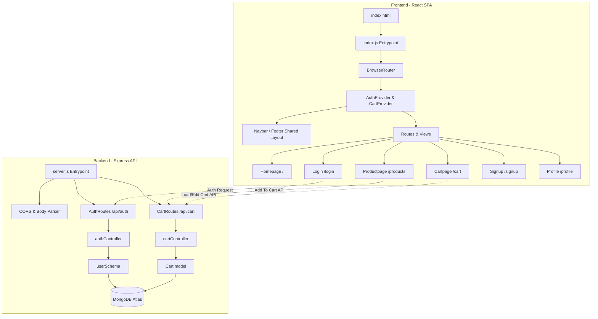

# Zonda Core Architecture & System Design Report

This document details the core architecture, directory structure, component relationships, routing flows, database models, and API configurations of the **Zonda** e-commerce application. 

---

## 1. System Overview

Zonda is built as a full-stack web application with a decoupled client-server architecture:
*   **Frontend**: Built with **React**, styled with **Bootstrap 5.3** and custom CSS variables for premium themes and micro-animations. It acts as a Single Page Application (SPA) with routing handled via **React Router DOM**.
*   **Backend**: Built with **Node.js** and **Express**, managing connections to **MongoDB Atlas** database via **Mongoose**, generating JWT tokens, and verifying API requests.



---

## 2. Directory Structure

The project separates the full-stack codebase into `frontend` and `backend` folders:

```text
zonda/
├── backend/
│   ├── config/
│   │   └── db.js              # Database connection configuration
│   ├── controller/
│   │   ├── authController.js  # Registration, login & profile API actions
│   │   └── cartController.js  # Add, get, update, remove, and clear cart actions
│   ├── middleware/
│   │   └── authMiddleware.js  # JWT validation & user attachment middleware
│   ├── model/
│   │   ├── Cart.js            # User shopping cart schema
│   │   └── userSchema.js      # User registration & hashed password schema
│   ├── routes/
│   │   ├── authRoutes.js      # Auth API mappings (/signup, /login, /me)
│   │   └── cartRoutes.js      # Cart API mappings (/add, /update, /remove/:id)
│   ├── .env                   # Environment variables (DB URI, JWT secret)
│   ├── .gitignore             # Ignores backend/node_modules and env keys
│   ├── package.json           # Node scripts and dependencies
│   └── server.js              # Express application configuration & entry point
└── frontend/
    ├── public/
    │   ├── media/             # Image resources & product assets
    │   └── index.html         # Main HTML markup
    ├── src/
    │   ├── context/
    │   │   ├── AuthContext.js # Auth global provider (tokens, login, logout states)
    │   │   └── CartContext.js # Cart global provider (cart items, counts, sync logic)
    │   ├── landingpage/
    │   │   ├── about/
    │   │   │   ├── Aboutpage.js   # About page (company story and values)
    │   │   │   └── Team.js        # Team showcase component
    │   │   ├── deal/
    │   │   │   ├── Branddeal.js   # Brand partnership spotlight cards
    │   │   │   └── Dealpage.js    # Flash deals with active countdown timer
    │   │   ├── home/
    │   │   │   ├── Brand.js       # Partner brand spotlights
    │   │   │   ├── Feature.js     # Featured products catalog
    │   │   │   ├── Hero.js        # Interactive hero carousel
    │   │   │   ├── Homepage.js    # Landing page aggregator
    │   │   │   └── Suggest.js     # "Recommended For You" carousel/cards
    │   │   ├── product/
    │   │   │   └── Productpage.js # Full catalog with filtering & cart triggers
    │   │   ├── singup/
    │   │   │   ├── Cartpage.js    # Cart dashboard, totals, and checkout flow
    │   │   │   ├── Login.js       # User login screen with eye toggle
    │   │   │   ├── Profilepage.js # User profile dashboard
    │   │   │   └── Singup.js      # Registration page with eye toggles
    │   │   ├── support/
    │   │   │   └── Supportpage.js # Support forms and FAQs
    │   │   ├── Footer.js          # Premium, responsive website footer
    │   │   └── Navbar.js          # Sticky blur-backdrop header & dynamic badge
    │   ├── index.css              # Typography and global CSS variables
    │   └── index.js               # React SPA router bootstrap
    └── package.json           # Frontend scripts and dependencies
```

---

## 3. Frontend Architecture & Logic

### 3.1 App Bootstrapping & Routing (`frontend/src/index.js`)
The application wraps components inside `<AuthProvider>` and `<CartProvider>` contexts to ensure credentials and shopping states are accessible globally:

| Path | Component | Auth Requirement | Description |
|---|---|---|---|
| `/` | `Homepage` | None | Main landing page. |
| `/products` | `Productpage` | None | Product grid with category, price filter, and search. |
| `/deals` | `Dealpage` | None | Promotional discount countdown page. |
| `/signup` | `Singup` | None | User account creation interface. |
| `/login` | `Login` | None | Credentials entry screen. |
| `/profile` | `Profilepage` | Required | Displays authenticated user information. |
| `/cart` | `Cartpage` | Required | Lists items, quantities, totals, and checkout triggers. |

### 3.2 Dynamic Context Managers

#### A. Session State Context (`AuthContext.js`)
- Stores user credentials and token states.
- Persists session tokens in browser `localStorage`.
- Decodes JWT tokens on load to resume sessions automatically.

#### B. Shopping Cart Context (`CartContext.js`)
- Watches `token` changes from the `AuthContext` to fetch the user's cart automatically upon login, or reset state to empty on logout.
- Implements async functions calling backend endpoints (`fetchCart`, `addToCart`, `updateCartQuantity`, `removeFromCart`, `clearCart`).
- Calculates the `cartCount` badge utility.

### 3.3 Dynamic Navigation Badges (`Navbar.js`)
- Subscribes to `useCart()` to pull `cartCount`.
- Uses short-circuit rendering (`cartCount > 0 && (...)`) to display the red badge only when items exist.

---

## 4. Backend Server Design & Logic

### 4.1 Security & Authentication Schemas (`userSchema.js`)
Mongoose model for user registers:
- Hashes password automatically in a `pre("save")` hook using `bcrypt` before storing.
- Includes a utility schema method `comparePassword` for login matching.

### 4.2 Shopping Cart Model (`Cart.js`)
- `userId`: references the `User` schema.
- `items`: subdocument array of products consisting of `productId` (Number), `quantity` (Number), and `price` (Number).

### 4.3 Protected API Middleware (`authMiddleware.js`)
- Validates the presence of `Authorization: Bearer <token>` request header.
- Decodes token using JWT, retrieves user credentials, and appends user to `req.user`.

### 4.4 API Endpoints Map

#### Auth Endpoint (`/api/auth`)
- `POST /signup` - Creates a new user, hashes password, saves to Atlas database, and returns JWT.
- `POST /login` - Matches credentials and returns JWT token.
- `GET /me` - Returns logged-in user profile parameters.

#### Cart Endpoint (`/api/cart`)
- `GET /` - Fetches authenticated user's cart (creates one if none exists).
- `POST /add` - Appends item or increments quantity if item already exists. Validates `productId` against a static registry.
- `PATCH /update` - Modifies quantity values.
- `DELETE /remove/:productId` - Removes product.
- `DELETE /clear` - Empties the cart array (checkout simulation).

---

## 5. UI Custom Styling & CSS Rules (`index.css`)
- **Theme Color Variables**: Defined under `:root` (`--primary-color: #0d6efd`, `--text-dark: #0f172a`, `--bg-slate: #f8fafc`).
- **Premium Glassmorphism**: Utilizes class `.glass-panel` containing `backdrop-filter: blur(12px)` and transparent border highlights.
- **Animations**:
  - `@keyframes fadeInUp`: Triggers cards to transition in gracefully.
  - `@keyframes float`: Infinitely slides active elements up and down.
